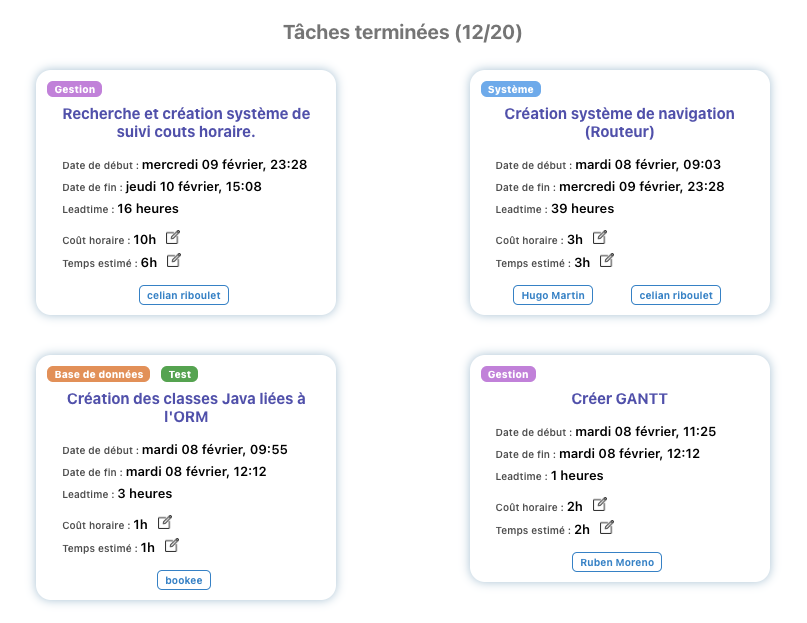
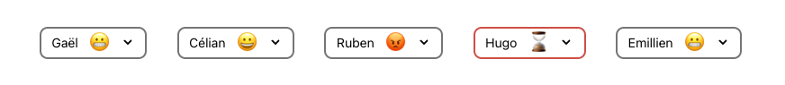

<h1 align="center">PT4 - Dashboard</h1>

Trello but with enhanced project management features !

<h5 align="center">
  <a href="https://pt4-dashboard.netlify.app/">See website</a>
</h5>

 
<h1 align="center">Task tracking !</h1>

 
<h1 align="center">Team mood !</h1>

***

**Features** :
- Linked with a [trello project board](https://trello.com/b/Osys3HjD/pt4).
- Calculate production dates for ech tasks.
- Track task leadtime.
- Track hourly cost.
- Gathers the information given in meetings.

***

## Start the project

Project dependencies : `npm i`

Start in developement : `npm run start`

## Build & Deploy

Build : `npm run build`

Deploy : `netlify deploy --prod`
